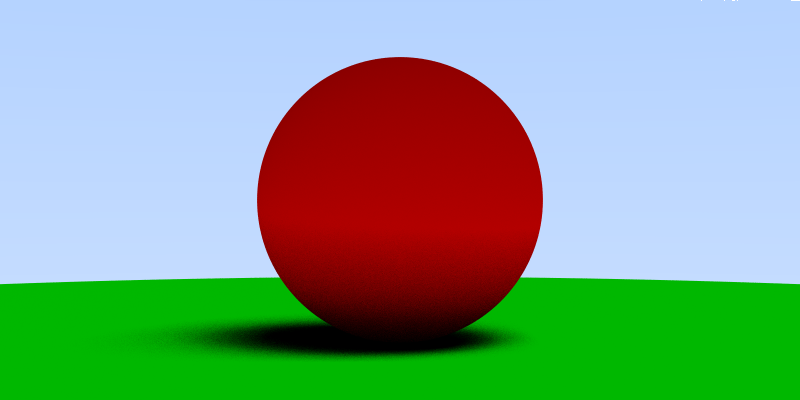
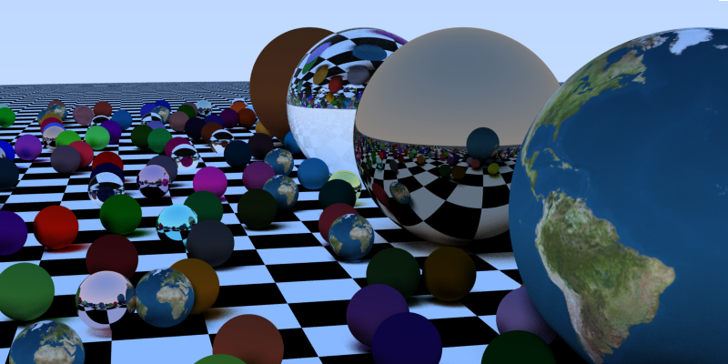

# goraytracing
Raytracing in a weekend port to go. Following my [c++](https://github.com/mehrmann/raytracing) and [kotlin](https://github.com/mehrmann/kraytracing) implementations, this time tried out [golang](https://golang.org/) and it's pretty awesome for concurrency things...

[](https://travis-ci.com/mehrmann/goraytracing)






# Usage
Build using

`$> go build`

Run with

`$> gotracing --help`

```
-filename string
    	the name of the output png (default "out.png")
  -h int
    	height of rendered Image (default 400)
  -rays int
    	passes per pixel (default 8)
  -t int
    	number of parallel threads (default 4)
  -w int
    	width of rendered image (default 800)
  -world int
    	select which world to render (0-3)
```

Example
`./goraytracing -w 320 -h 200 -rays 16 -t 8 -w 1 -filename out.png`
